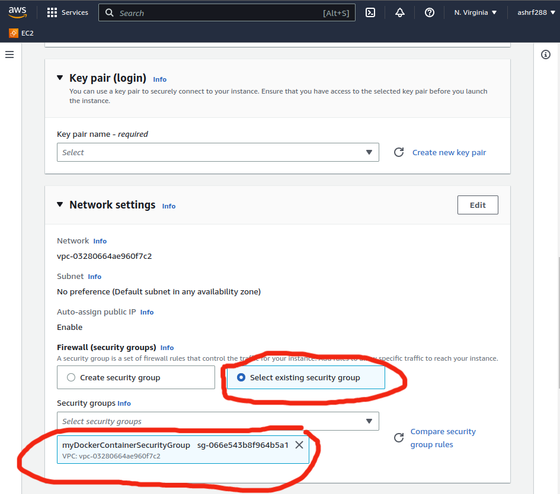

# create aws account

1- create  aws account if you dont have one

2- log in to your aws console

3- select EC2 service from the list of services


4- now you will be directed to the EC2 dashboard on the left side you will see a list of options


5- look for the "security groups" option and click on it , it should be under the "network & security" section


# create a security group

+ click on "security groups"
+ click on "create security group"
+ give it a name (e.g. "myDockerContainerSecurityGroup")
+ give it a description (e.g. "security group for my docker container")
+ add the inbound rules:
    + `type: "custom tcp" (port 8001) source (anywhere IPV4)`
         port number should be the same port you specified in your docker-compose file
    + `type: "http" (port 80) source (anywhere IPV4)`
    + `type: "ssh" (port 22) source (anywhere IPV4)`
         this to help you connect with your instance via ssh so for security reasons you should add your ip address only.

once your done your security group should look like this:


+ leave the rest as default and click on "create security group"

+ click on "create security group"


+ if everything is ok you should see your security group in the list of security groups

**now we are ready to create our ec2 instance**

click on "instances" on the left side of the dashboard


# create a new ec2 instance

+ click on `launch instance`
+ for names and tags section: give it a name (e.g. "myDockerInstance")

+ for the application and os section: choose `ubuntu` os


+ choose `t2.micro` as the instance type (its usually the default one)
+ key pair: create a new key pair this will be used to connect to the instance via ssh (you will download a file with the key pair name you specified)


+ for network settings: click on select an existing security group and choose the one we created in the  previous step



+ leave the rest as default and click on **"launch instance"**


# connect to the instance 

+ click on `instances` from the left side of the dashboard
+ select the instance you just created (ex: myDockerInstance) click on `actions` and then click on `connect`
+ now you can either connect via `ssh` or via the browser  (`instance connect`)
+ click on `connect` button and you will be directed to a new tab which will display  a terminal


+ now you can execute commands on the  just like a normal terminal


**from now on all the steps will be executed on the terminal**


**if you dont want to use sudo for every command then run `sudo su`**

# install docker

    ```
        sudo apt-get update
        sudo apt-get upgrade
        sudo apt install docker.io
        systemctl start docker
        systemctl enable docker
        docker --version
    ```
    
**after that install docker-compose:**
    
    ```
        sudo curl -L "https://github.com/docker/compose/releases/download/1.25.4/docker-compose-$(uname -s)-$(uname -m)" -o /usr/local/bin/docker-compose
        sudo chmod +x /usr/local/bin/docker-compose
    ```

# clone your repository

    ```
        git clone <REPO LINK >

    ```

# run your docker container

    ```
        cd <REPO NAME>
        sudo docker-compose build && sudo docker-compose up
    ```


#### run django commands for that image 

    ```
        sudo docker-compose exec web python manage.py makemigrations
        sudo docker-compose exec web python manage.py migrate
    ```

or `docker-compose run --rm web bash` and now your in the docker terminal and you can run django commands normally


    ``` 
        python manage.py makemigrations
        python manage.py migrate
    ```
##  open your app in the browser


+ beneath the terminal you will see your public ip address and your private ip address

+ copy the public ip address to a new tab in the browser and add port number to it (ex: `http://<PUBLIC IP>:8001`) you should see your app in the browser (the `/` route to be exact) 

**or you can do the following to get to the public ip address if your not on the terminal**

+ click on your instance id it will be highlighted in blue 


+ it will direct you to the instance details page

+ click on "public ip" (on the right side)


+ now you can open your app in the browser by typing the public ip address in the browser and add port number to it 

e.g. http://<PUBLIC IP>:8001

+ now you can add your routes to the url and see the result in the browser


## important note 

if you stop your instance and start it again the public ip address will change 
