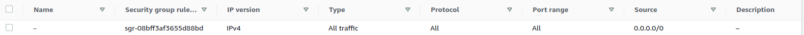

# deploy your front end app to ec2 instance 


you can upload your front end app to ec2 where you can use the same one you used to deploy your backend app (on different port) or you can create a new one.


### steps to deploy your front end app to ec2 instance


+ step 1 (configure your security group):

modifiy the security group of your ec2 instance to accept now a new port connection (ex: 3000) because  the default port for react/next app is 3000.

 **custom tcp rule with port 3000**

 

**or you can allow the security group to accept all ports**




+ step 2 (connect to your ec2 instance):

connect to your ec2 instance via ssh using the key pair you created when you created the instance.

```bash

ssh -i "key_pair_name.pem" ubuntu@ec2_public_ip

```

+ step 3 (install required packages):

install the required packages to run your app (ex: nodejs, npm,  etc..)

```bash

sudo apt-get update

sudo apt-get install nodejs

sudo apt-get install npm

```

+ step 4 (clone your app):

clone your app from github or any other source control.

```bash

git clone <REPO LINK>

```

or you can upload your app to ec2 instance using scp

```bash

scp -i "key_pair_name.pem" -r <PATH TO YOUR APP> ubuntu@ec2_public_ip:~

```

+ step 5 (install dependencies):

install the dependencies of your app

```bash

cd <APP NAME>

npm install

```

+ step 6 (run your app):

run your app

```bash

npm run dev

```

+ step 7 (access your app):

access your app from your browser using the public ip of your ec2 instance and the port you configured in the security group (ex: 3000)

```bash

http://ec2_public_ip:3000

```


